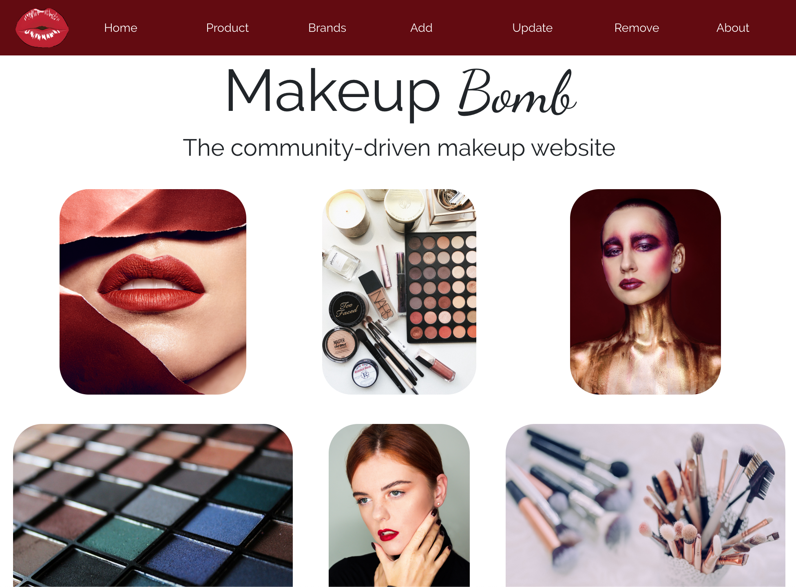

# MakeupBomb

This full-stack MERN application is a place for makeup lovers to share information about products. This application has full CRUD capabiity. Users can add / view / edit / and delete products through the interface.

## Installation

To install this project locally on your machine, either clone or fork and clone this repo. In the command line, run `git clone <origin>`. From inside the project run `npm install` to install dependencies. finally, run `npm start` to open the project on a local server.

to access the deployed version click [here](https://quizzical-goldstine-b0be04.netlify.com/)

## Motivations

This purpose of this application is to provide makeup information about multiple brands in one place. This project utilized my makeupinfo REST API on the backend.

- To see the full list of JSON data in the deployed makeupinfo API [click here](https://makeupinfo.herokuapp.com/product)
- To see the repository for the makeupinfo API [click here](https://github.com/karenheyn/MakeupAPI)

The next step for this project is to add the ability to leave comments on each product by adding additional backend functionality.

## Technologies Used

- mongoose
- express
- react
- node
- bootstrap
